# Ramya Joshi

  <picture>
    <source media="(prefers-color-scheme: dark)" srcset="./dark.svg">
    <source media="(prefers-color-scheme: light)" srcset="./light.svg">
    
  </picture>

## 👩‍💻 About Me

I'm an **AIML Engineering student** building practical projects across **Data Science, Machine Learning, and Data Engineering**.

- 🔭 Currently working on AI/ML and predictive analytics projects.
- 🌱 Currently learning **SQL, Python, Statistics, Machine Learning, and Data Engineering**.
- 💬 Ask me about **Python, SQL, Machine Learning, NLP, Data Analytics, and Streamlit**.
- 🤝 Interested in collaborating on **Data Science, Machine Learning, and Data Engineering projects**.
- ⚡ I enjoy turning real-world problems into data-driven solutions.

## 🧠 Focus

**Data Science · Machine Learning · Data Engineering · Predictive Analytics**

## 🛠️ Engineering Stack

**Languages & Data**
- Python
- SQL
- Pandas
- NumPy

**Machine Learning / AI**
- TensorFlow
- Keras
- PyTorch
- OpenCV
- EasyOCR
- NLP

**Applications**
- Streamlit
- Flask

**Data / Cloud**
- Apache Kafka
- Spark
- AWS

## 🚀 Featured Projects

### SmartDoseAI
AI-based drug dosage prediction system combining disease prediction, digital-twin simulation, smart dose recommendation, and explainable output.

### Product Return Prediction
A predictive analytics project designed around return-probability prediction at the order-placement stage.

### TravelQA
A travel question-answering project combining information retrieval with a structured travel knowledge base.

### Aviation Information Extraction System
A Streamlit-based NLP application for extracting structured information from aviation incident PDFs.

## 📌 Current Direction

I'm focused on strengthening the foundations that matter for data-focused engineering roles:

**Python → SQL → Statistics → Machine Learning → Data Engineering**

## 🔗 Connect

- [LinkedIn](https://www.linkedin.com/in/ramyasjoshi/)

---

  Designed as a minimal, technical GitHub profile system.

